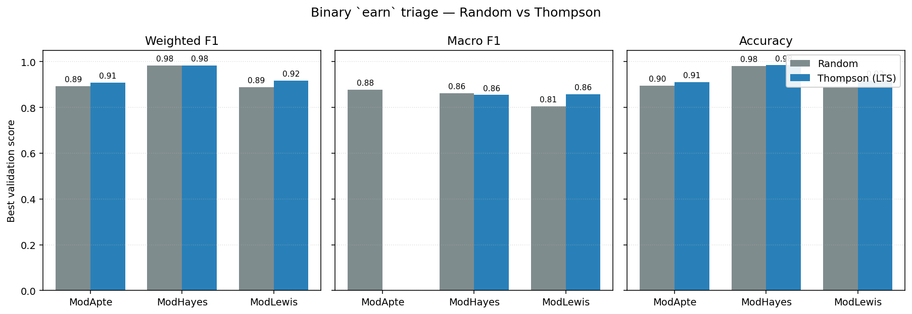
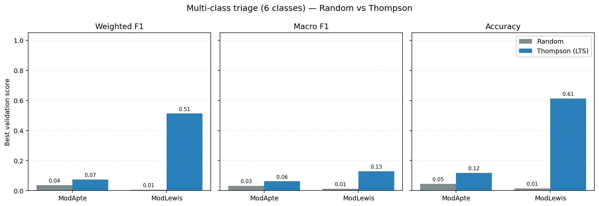
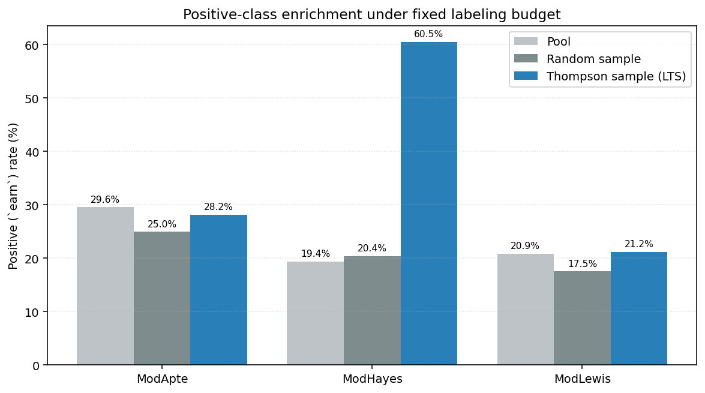
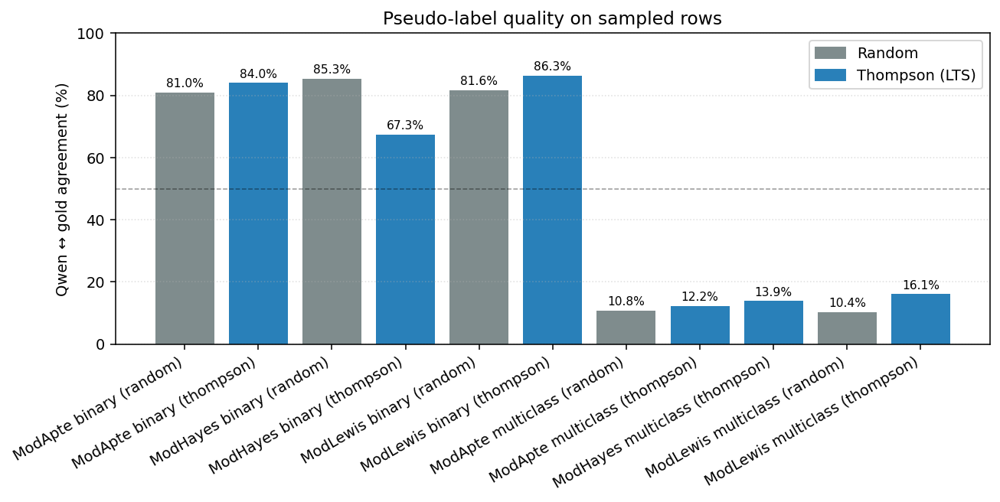
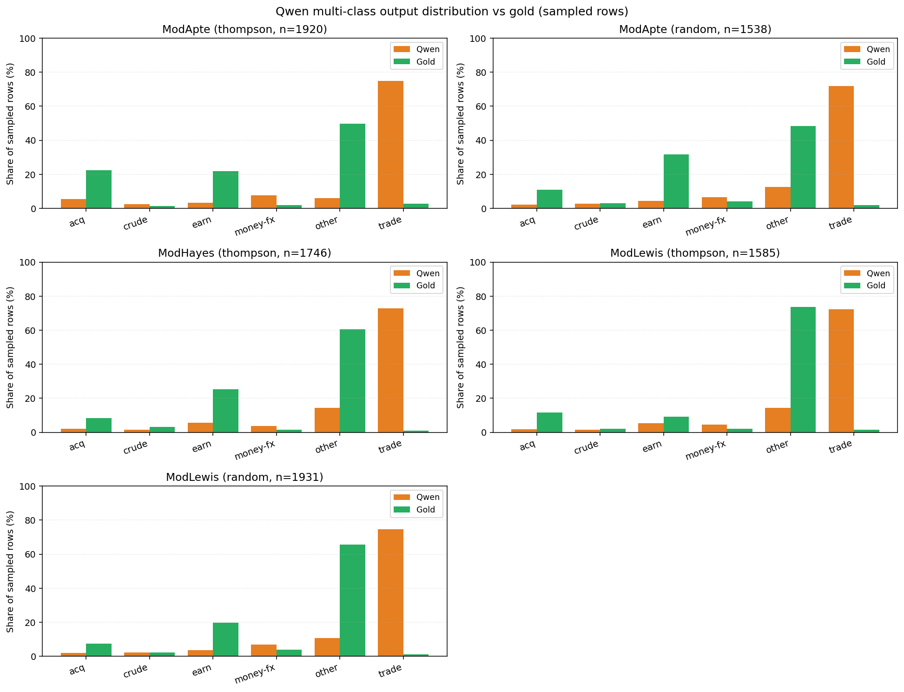

# Reuters Results: Random Sampling vs Thompson Sampling (LTS)
_Auto-generated by `scripts/analyze_results.py` from the JSON / CSV artifacts in `data_use_cases/`. Numbers are best-iteration values across the LTS active-learning loop._
## 1. Best-iteration metrics by run
| Split | Task | Sampling | Best F1 | Best macro F1 | Best acc | Best key | Pseudo rows | Pseudo agreement |
|---|---|---|---:|---:|---:|---|---:|---:|
| ModApte | binary | random | 0.8940 | 0.8778 | 0.8959 | random | 1734 | 0.8103 |
| ModApte | binary | thompson | 0.9090 | n/a | 0.9111 | 0 | 3919 | 0.8400 |
| ModApte | multiclass | random | 0.0362 | 0.0318 | 0.0454 | random | 1538 | 0.1079 |
| ModApte | multiclass | thompson | 0.0734 | 0.0616 | 0.1178 | 6 | 1920 | 0.1219 |
| ModHayes | binary | random | 0.9832 | 0.8627 | 0.9819 | random | 3602 | 0.8529 |
| ModHayes | binary | thompson | 0.9842 | 0.8550 | 0.9847 | 0 | 2000 | 0.6730 |
| ModHayes | multiclass | thompson | 0.6381 | 0.1397 | 0.7167 | 8 | 1746 | 0.1386 |
| ModLewis | binary | random | 0.8886 | 0.8059 | 0.8891 | random | 1951 | 0.8160 |
| ModLewis | binary | thompson | 0.9177 | 0.8578 | 0.9174 | 6 | 2000 | 0.8630 |
| ModLewis | multiclass | random | 0.0059 | 0.0120 | 0.0146 | random | 1931 | 0.1036 |
| ModLewis | multiclass | thompson | 0.5130 | 0.1282 | 0.6131 | 9 | 1585 | 0.1609 |

## 2. Thompson vs Random (paired comparison)
Each row pairs the Thompson run with the matching random run (same dataset, same task type). `delta = thompson - random`.
| Split | Task | Labels | Thompson F1 | Random F1 | Δ F1 | Thompson macro F1 | Random macro F1 | Δ macro F1 |
|---|---|---|---:|---:|---:|---:|---:|---:|
| ModApte | binary | earn | 0.9090 | 0.8940 | 0.0150 | n/a | 0.8778 | n/a |
| ModApte | multiclass | multiclass_6cls | 0.0734 | 0.0362 | 0.0372 | 0.0616 | 0.0318 | 0.0298 |
| ModHayes | binary | earn | 0.9842 | 0.9832 | 0.0010 | 0.8550 | 0.8627 | -0.0076 |
| ModLewis | binary | earn | 0.9177 | 0.8886 | 0.0291 | 0.8578 | 0.8059 | 0.0519 |
| ModLewis | multiclass | multiclass_6cls | 0.5130 | 0.0059 | 0.5071 | 0.1282 | 0.0120 | 0.1162 |

## 3. Positive-class enrichment (binary tasks)
Compares the share of positive (`label == 1`) examples in the original pool, the random labeled sample, and the Thompson labeled sample.
| Split | Labels | Pool positive rate | Random sample rate | Thompson sample rate | Thompson lift |
|---|---|---:|---:|---:|---:|
| ModApte | earn | 29.57% | 24.97% | 28.17% | 3.20% |
| ModHayes | earn | 19.39% | 20.38% | 60.50% | 40.12% |
| ModLewis | earn | 20.85% | 17.53% | 21.20% | 3.67% |

## 4. Pseudo-label quality (Qwen vs gold on sampled rows)
| Split | Task | Sampling | Pseudo rows | Agreement |
|---|---|---|---:|---:|
| ModApte | binary | random | 1734 | 0.8103 |
| ModApte | binary | thompson | 3919 | 0.8400 |
| ModApte | multiclass | random | 1538 | 0.1079 |
| ModApte | multiclass | thompson | 1920 | 0.1219 |
| ModHayes | binary | random | 3602 | 0.8529 |
| ModHayes | binary | thompson | 2000 | 0.6730 |
| ModHayes | multiclass | thompson | 1746 | 0.1386 |
| ModLewis | binary | random | 1951 | 0.8160 |
| ModLewis | binary | thompson | 2000 | 0.8630 |
| ModLewis | multiclass | random | 1931 | 0.1036 |
| ModLewis | multiclass | thompson | 1585 | 0.1609 |

## 5. Qwen multi-class output distribution vs gold
For each multi-class run, this table shows what Qwen actually emitted vs what the gold labels are for the same sampled rows. A heavy skew toward one class (typically `trade`) indicates a prompting/calibration limitation rather than a pipeline bug.

### ModApte multiclass (thompson, 1920 sampled rows)
| Class | Qwen count | Qwen % | Gold count | Gold % |
|---|---:|---:|---:|---:|
| acq | 107 | 5.57% | 429 | 22.34% |
| crude | 45 | 2.34% | 27 | 1.41% |
| earn | 65 | 3.39% | 420 | 21.88% |
| money-fx | 148 | 7.71% | 36 | 1.88% |
| other | 116 | 6.04% | 955 | 49.74% |
| trade | 1439 | 74.95% | 53 | 2.76% |

### ModApte multiclass (random, 1538 sampled rows)
| Class | Qwen count | Qwen % | Gold count | Gold % |
|---|---:|---:|---:|---:|
| acq | 32 | 2.08% | 169 | 10.99% |
| crude | 43 | 2.80% | 46 | 2.99% |
| earn | 65 | 4.23% | 489 | 31.79% |
| money-fx | 101 | 6.57% | 61 | 3.97% |
| other | 193 | 12.55% | 742 | 48.24% |
| trade | 1104 | 71.78% | 31 | 2.02% |

### ModHayes multiclass (thompson, 1746 sampled rows)
| Class | Qwen count | Qwen % | Gold count | Gold % |
|---|---:|---:|---:|---:|
| acq | 34 | 1.95% | 144 | 8.25% |
| crude | 25 | 1.43% | 53 | 3.04% |
| earn | 100 | 5.73% | 443 | 25.37% |
| money-fx | 65 | 3.72% | 28 | 1.60% |
| other | 251 | 14.38% | 1059 | 60.65% |
| trade | 1271 | 72.79% | 19 | 1.09% |

### ModLewis multiclass (thompson, 1585 sampled rows)
| Class | Qwen count | Qwen % | Gold count | Gold % |
|---|---:|---:|---:|---:|
| acq | 29 | 1.83% | 184 | 11.61% |
| crude | 25 | 1.58% | 33 | 2.08% |
| earn | 84 | 5.30% | 143 | 9.02% |
| money-fx | 73 | 4.61% | 32 | 2.02% |
| other | 228 | 14.38% | 1169 | 73.75% |
| trade | 1146 | 72.30% | 24 | 1.51% |

### ModLewis multiclass (random, 1931 sampled rows)
| Class | Qwen count | Qwen % | Gold count | Gold % |
|---|---:|---:|---:|---:|
| acq | 37 | 1.92% | 144 | 7.46% |
| crude | 44 | 2.28% | 45 | 2.33% |
| earn | 69 | 3.57% | 380 | 19.68% |
| money-fx | 133 | 6.89% | 76 | 3.94% |
| other | 206 | 10.67% | 1266 | 65.56% |
| trade | 1442 | 74.68% | 20 | 1.04% |

## 6. Interpretation
- On binary `earn` triage, Thompson sampling beats random sampling on best weighted F1 in 3 of 3 splits (random wins in 0).
- ModApte binary: Thompson F1=0.9090, Random F1=0.8940 (Thompson higher by 0.0150).
- ModHayes binary: Thompson F1=0.9842, Random F1=0.9832 (Thompson higher by 0.0010).
- ModLewis binary: Thompson F1=0.9177, Random F1=0.8886 (Thompson higher by 0.0291).
- On multi-class triage (6 classes), Thompson sampling also outperforms random sampling, but absolute scores remain low.
- ModApte multiclass: Thompson F1=0.0734 / macro=0.0616; Random F1=0.0362 / macro=0.0318.
- ModLewis multiclass: Thompson F1=0.5130 / macro=0.1282; Random F1=0.0059 / macro=0.0120.
- Qwen pseudo-label agreement on ModApte multiclass (thompson) is only 12.19% on sampled rows — the multi-class prompt + few-shot examples should be upgraded before drawing strong conclusions.
